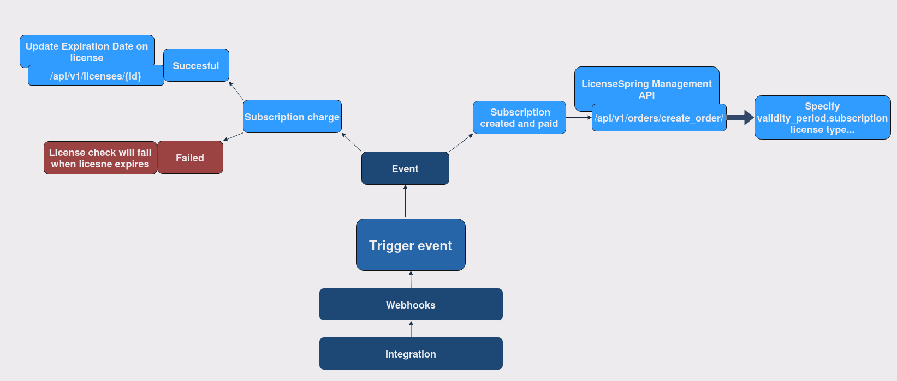

# Stripe Integrations inside LicenseSpring  
## Introduction
In this tutorial, we will guide you step-by-step through the process of managing your integration within **LicenseSpring**. Specifically, we will focus on utilizing **Stripe** and the **LicenseSpring Management API**. The backend will be managed using **Python** with the **Flask** framework.
### Tutorial Prerequisites  
Before beginning this tutorial, it's recommended that users familiarize themselves with:
* **[Management API](https://docs.licensespring.com/management-api)**
  *  [Authorization](https://docs.licensespring.com/management-api/authorization)
  *  [Retrieve License](https://docs.licensespring.com/management-api/license/retrieve), [Create Order](https://docs.licensespring.com/management-api/order/create-order), [Disable License](https://docs.licensespring.com/management-api/license/disable), [Generate License](https://docs.licensespring.com/management-api/order/generate-license), [Update License](https://docs.licensespring.com/management-api/license/update)
*  **[Integration](https://docs.licensespring.com/integrations)**
   *  [Subscription Integration](https://docs.licensespring.com/integrations/subscription-integration)
## Description
### Third party services and webhooks
Payment Integration such as **Stripe, FastSpring, SalesForce** and **etc.** are made possible through the use of **webhooks**. **Webhooks** are a powerful feature used in integrating **third-party** services with your application, providing a way for applications to receive **real-time information** from other services.
 <p align="center">_Handling Webhooks_</p>
Real time information can be also called an event. In our application we handle events: 
* **invoice.paid**
* **customer.subscription.deleted**

Detail explanation of event handling will be explained in future section's.
## Installation and Setup
### Prerequisites
* Python 3.11.4 
* Flask 3.0.0
* A Stripe account with API keys and subscription product
* LicenseSpring account with API keys
### Stripe Setup
 1. Go to Stripe [website](https://stripe.com/)
 2. Create recurring product --> Subscription model
 3. Setup Stripe CLI -->[Stripe provides binaries for macOS, Windows, and Linux.](https://stripe.com/docs/stripe-cli)
   
### Project Setup  
  
1. Clone the repository:
    * `git clone repo..`    
  
2. Create virtual env:  
     *  `python -m venv venv`
     * `source venv/bin/activate` # On Windows use `venv\Scripts\activate`
     * `pip install -r requirements.txt`
3. Create .env file
```
API_MANAGAMENT_KEY="api_management_key_from_LS" 
UUID = "your_uuid_from_LS"
SHARED_KEY ="shared_key_from_LS"
PRODUCT_SHORT_CODE = "LS_product"
ORDER_BASE_STRING="stripe_order_env"
BASE_URL="https://saas.licensespring.com"
API_URL ='https://api.licensespring.com'
STRIPE_PRIVATE_KEY="your_stripe_key"
STRIPE_PRODUCT="your_stripe_product" 
```
License Spring Keys can be found inside [portal](https://saas.licensespring.com) *Settings --> Keys*. *ORDER_BASE_STRING* is just name of order_id.  
STRIPE_PRIVATE_KEY can be found in _Developers --> API keys --> Secret key_  
STRIPE_PRODUCT can be found in _Products --> Pricing --> API ID_  

## Application 

1. Open side terminal which will listen to webhook events and run commands:
   * `stripe login` --> login to your Stripe account
   * `stripe listen --forward-to http://localhost:5000/webhook` --> Stripe will send Stripe Secret inside terminal
   * add Stripe Secret to .env file **STRIPE_SECRET="your_secret"**
2. Run flask app --> `flask run` 

### App Usage
### Create License 
 1. Visit inside your web --> **http://localhost:5000/**
 2. Click --> Create Payment Link 
 3. Click on stripe payment link and proceed payment

If payment was successful **LicenseSpring** will create **Subscription** type license. You can check your [portal](https://saas.licensespring.com).   
This application handles when **subscription** is cancelled inside **stripe**. License will become **disabled** and **valid duration** will be set depending on **stripe billing cycle** (day,week,month and year).  
Application handles incoming invoices of subscription which were made from application.  
For detail explanation of code check **Detail Explanation** section  
**WARNING: New invoices and cancel subscription are handled only for subscriptions inside cache**    
**WARNING: This application handles up to 100 licenses. After you try to create 101th subscription first one is removed. There is no database model everything is saved inside cache.json**
### Detail Explanation
**Project tree**
```
├── app.py
├── cache_funs.py
├── cache.json
├── licensespring.py
├── READ.md
├── requirements.txt
├── templates
    └── home.html
```
#### app.py
This Python script uses Flask, a web framework, to create a web application. It interacts with the Stripe API for payment processing and manages subscriptions and licenses.  
**Routes**  
* **app.route("/")**: Defines the home page route. When visited, it renders home.html  
* **@app.route("/create-payment-link")**: Creates a payment link using Stripe's PaymentLink API, responding with the link URL in JSON format.
* **@app.route("/webhooks", methods=["POST"])**: Handles incoming webhooks from Stripe.

###### **Webhooks**
**Invoice paid**  
When an invoice.paid event is received there are 2 cases:     
1. **New subscription**   
It checks if **subscription_id** is in **cache.json**. If **subscription_id** is **NOT** in **cache** it processes the subscription payment, generates a license key, and creates an order inside LicenseSpring. Also metadata field of Stripe subscription is updated with license key.
2. **Already existing subscription**  
If **subscription_id** is in **cache** then License expiry date is updated   


**customer.subscription.deleted**  
When subscription is cancelled. License will become disabled with valid duration. 

**WARNING**: If license is not in cache no updates will be made

#### licensespring.py

**disable_license(license_id)**  
 Disable a specific license identified by license_id

**retrieve_license_validity(license_id)**  
Get the validity period of a given license

**cancel_sub(license_id, interval)**  
Update a license's status when its associated subscription is canceled, marking it for a specific remaining valid duration

**update_license_subscription(license_id, interval, validity)**  
To extend the validity of a license based on its subscription renewal.

**create_order(license_key, order_number, interval)**  
This function is used to create a new order. It calculates a validity date for the license based on the given interval, constructs a body for the POST request with order details

**generate_license()**  
This function sends a GET request to generate a new license.

#### cache_funs.py
Functions which handle cache
#### cache.json  
Functions like database which can handle up to 100 subscriptions
   
    


   


  