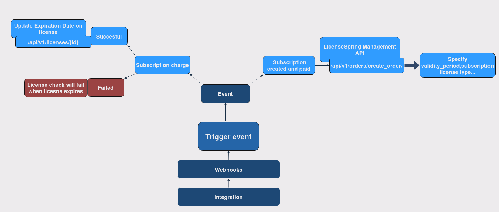
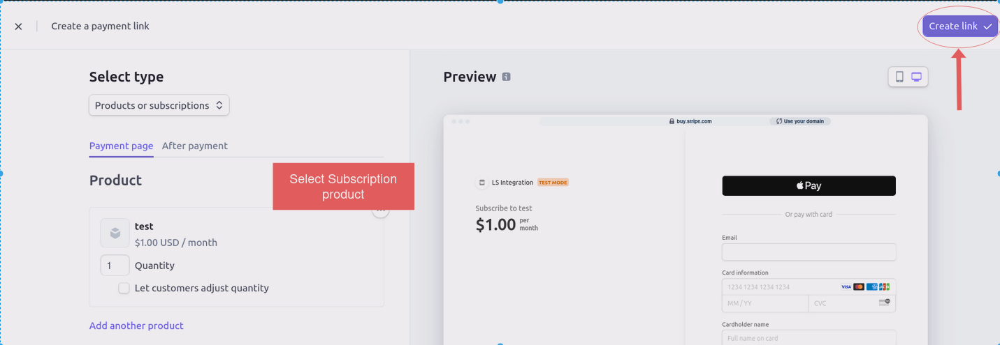
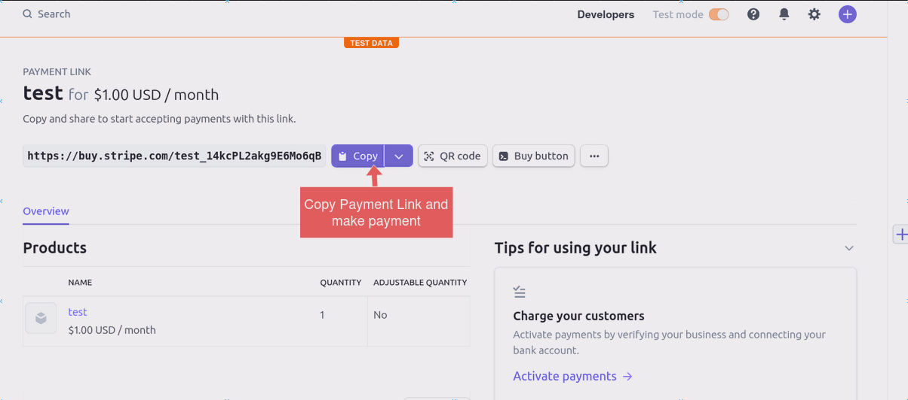

# Stripe Integrations inside LicenseSpring  
## Introduction
In this tutorial, we will guide you step-by-step through the process of managing your integration within **LicenseSpring**. Specifically, we will focus on utilizing **Stripe** and the **LicenseSpring Management API**. The backend will be managed using **Python** with the **Flask** framework.
### Tutorial Prerequisites  
Before beginning this tutorial, it's recommended that users familiarize themselves with:
* **[Management API](https://docs.licensespring.com/management-api)**
  *  [Authorization](https://docs.licensespring.com/management-api/authorization)
  *  [Retrieve License](https://docs.licensespring.com/management-api/license/retrieve), [Create Order](https://docs.licensespring.com/management-api/order/create-order), [Disable License](https://docs.licensespring.com/management-api/license/disable), [Generate License](https://docs.licensespring.com/management-api/order/generate-license), [Update License](https://docs.licensespring.com/management-api/license/update)
*  **[Integration](https://docs.licensespring.com/integrations)**
   *  [Subscription Integration](https://docs.licensespring.com/integrations/subscription-integration)
## Description
### Third party services and webhooks
Payment Integration such as **Stripe, FastSpring, SalesForce**,  **etc.** are made possible through the use of **webhooks**. **Webhooks** are a powerful feature used in integrating **third-party** services with your application, providing a way for applications to receive **real-time information** from other services.
 <p align="center">_Handling Webhooks_</p>
Real time information can be also called an event. In our application we handle events: 
* **invoice.paid**
* **customer.subscription.deleted**
* **customer.subscription.created**

Detail explanation of event handling will be explained in future section's.
## Installation and Setup
### Prerequisites
* Python 3.11.4 
* Flask 3.0.0
* A Stripe account with API keys and subscription product
* LicenseSpring account with API keys
### Stripe Setup
 1. Go to Stripe [website](https://stripe.com/)
 2. Create recurring product --> Subscription model
 3. Setup Stripe CLI -->[Stripe provides binaries for macOS, Windows, and Linux.](https://stripe.com/docs/stripe-cli)
   
### Project Setup  
  
1. Clone the repository:
    * `git clone repo..`    
  
2. Create virtual env:  
     *  `python -m venv venv`
     * `source venv/bin/activate` # On Windows use `venv\Scripts\activate`
     * `pip install -r requirements.txt`
3. Create .env file
```.env
API_MANAGEMENT_KEY = "api_management_key_from_LS"   
UUID = "your_uuid_from_LS"  
SHARED_KEY = "shared_key_from_LS"  
PRODUCT_SHORT_CODE = "LS_product"  
BASE_URL = "https://saas.licensespring.com"  
API_URL = "https://api.licensespring.com"  
STRIPE_PRIVATE_KEY = "your_stripe_key"  
STRIPE_PRODUCT = "your_stripe_product"   
STRIPE_SECRET = "your_stripe_secret"    
PAYMENT_LINK = "payment_link"  
```
License Spring Keys can be found inside [portal](https://saas.licensespring.com) under *Settings --> Keys*. 
STRIPE_PRIVATE_KEY can be found in _Developers --> API keys --> Secret key_  
STRIPE_PRODUCT can be found in _Products --> Pricing --> API ID_  
Add your Stripe payment link to PAYMENT_LINK     
Add your webhook signing secret to STRIPE_SECRET; this information is available after starting your webhook `"whsec_*******"`
#### Payment link  
Go to _Stripe --> Payments --> Payment link_. First define your subscription product then copy paste payment link inside **.env file**
<p align="center">
  
   
</p>


## Application 

1. Open side terminal which will listen to webhook events and run commands:
   * `stripe login` --> login to your Stripe account
   * `stripe listen --forward-to http://localhost:5000/webhooks` --> Stripe will send Stripe Secret inside terminal
   * add Stripe Secret to **.env file** `STRIPE_SECRET="whsec_*******"`
2. Run flask app --> `flask run` 

### App Usage
### Create License 
 1. Visit inside your web --> **http://localhost:5000/**
 2. **Create Payment Link**
 3. Click on stripe payment link and proceed payment

If payment was successful **LicenseSpring** will create **Subscription** type license. You can check your [portal](https://saas.licensespring.com).   
This application handles when **subscription** is cancelled inside **stripe**. License will become **disabled** and **valid duration** will be set depending on **stripe billing cycle** (day,week,month and year). Application handles incoming invoices of subscription which were made from application.  
**WARNING: Demo application accepts only products which are subscription type with stripe billing cycle day,week,month and year**    
**INFO: cache.json handles if 2 same stripe events occur** 


### **Webhooks**
**customer.subscription.created** 

1. The **billing interval** (like monthly, yearly) and **subscription_id** are extracted  from the event data.  
2. function **generate_license()** generates unique LicenseSpring key
3.  **Stripe's API** is called to modify the subscription data. license key is added  to the subscription's metadata. **This is important for keeping a record of the license key associated with each subscription.**
4.  **Order is created inside LicenseSpring**

**invoice.paid**
1. License is extracted from event --> if there is already subscription license is extended. Else **customer.subscription.created** creates new subscription with new license key

**customer.subscription.deleted**  

1. When subscription is cancelled. License will become **disabled** with **valid duration**. 


   
    


   


  